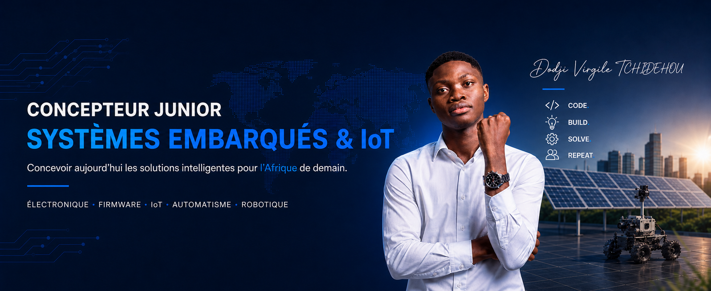

  

<h1 align="center">Hi, I'm Dodji Virgile TCHIDEHOU</h1>

  <strong>Industrial Computing &amp; Maintenance graduate</strong> 
  Embedded systems · Electronics · RTOS · IoT · Robotics · Cyber-physical systems

  
  
  

## About me

I build connected systems at the intersection of electronics, real-time firmware, IoT and robotics. I am especially interested in reliable cyber-physical systems for agriculture, energy and industrial applications.

- Graduate in Industrial Computing & Maintenance from UCAO-UUC
- Ranked 2nd out of 25 with a final average of 16.43/20 and highest honours
- Hands-on experience with ESP32, FreeRTOS, MQTT, PCB design, automation and industrial maintenance
- Currently going deeper into embedded C/C++, RTOS, Embedded Linux, ROS 2 and Edge AI
- Preparing for an international Master's programme in embedded systems, mechatronics or robotics

## Selected engineering work

### 🌱 [SMART-SOJA](https://github.com/virgile-tchidehou/smart-soja)

Mobile and connected soybean pre-processing unit co-developed as my final-year engineering project.

My work focused on the technical architecture, SolidWorks mechanical design, KiCad electronics and PCB, ESP32/C++ firmware, FreeRTOS task architecture, GRAFCET control logic, MQTT/JSON communication, backend integration and monitoring interface.

[Project case study](https://tdv-tech.vercel.app/en/projects/smart-soja/)

### ⚙️ [Embedded Systems Lab](https://github.com/virgile-tchidehou/embedded-systems-lab)

A structured hands-on laboratory where I document experiments in embedded C/C++, ESP32, FreeRTOS, peripherals, communication protocols and reusable drivers.

Current work includes GPIO, ADC, PWM, MQTT and FreeRTOS primitives such as tasks, queues, semaphores, mutexes, event groups and software timers.

### 📡 [IoT Platform Lab](https://github.com/virgile-tchidehou/iot-platform-lab)

A companion laboratory focused on the path from embedded devices to connected platforms: MQTT, TLS, QoS, retained messages, Last Will, HTTP, WebSockets and device-to-cloud architectures.

### 🤖 Tekbot Robotics Challenge 2025

Team leader and electronics contributor for Team UCAO-TECH. My work included team coordination and contributions around embedded electronics, I²C communication, sensing, actuation and robotic subsystems.

[Team documentation](https://tekbot-robotics-challenge.github.io/2025-Team-UCAO-TECH-Docs/)

## Technical stack

### Embedded systems and electronics

### IoT and software

### Engineering tools and methods

`SolidWorks` · `GRAFCET` · `Ladder` · `I²C` · `UART` · `SPI` · `PCB design` · `Electronic diagnostics` · `Solar systems`

## Current direction

**Embedded C/C++ → RTOS → Embedded Linux → ROS 2 → Edge AI**

My goal is to deepen my scientific and industrial foundations in embedded and cyber-physical systems and build robust technologies that can operate reliably outside the laboratory.
